# Hardware build

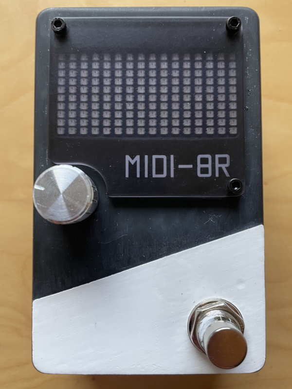

## Tools

This pedal can be built entirely with hand tools (no "and now we take out our industrial CNC
machine..." here). I ended up using:
* Soldering iron
* Drill (a hand drill or cordless drill is actually preferable to a powerful drill here;
  I used a low-powered electric screwdriver for most of it)
* Coping saw
* Stanley knife and/or hobby knife (box cutter)
* Narrow metal files and/or cheap disposable emery boards
* Sand paper / sanding sponges

## Components

#### Essential components

The below are the exact compoments I bought in the UK. The total came to about 50GBP with delivery.
It's definitely possible to get some of these components cheaper by shopping around a bit.

| Component | Cost (GBP) |
| --------- | ---------- |
| [Raspberry Pi Pico](https://thepihut.com/products/raspberry-pi-pico) | 3.60 |
| [Adafruit MIDI FeatherWing Kit](https://thepihut.com/products/adafruit-midi-featherwing-kit) | 6.00 |
| [Rotary Encoder + Extras](https://thepihut.com/products/rotary-encoder-extras) | 3.90 |
| [RGB Full-colour LED Matrix Panel for Raspberry Pi Pico](https://thepihut.com/products/rgb-full-color-led-matrix-panel-for-raspberry-pi-pico-16x10) | 13.50 |
| [Easy Assembly Electronics Enclosure - Size 2](https://thepihut.com/products/easy-assembly-electronics-enclosure-size-2) | 4.30 |
| [M2.5 Nylon Standoffs Pack (6mm F/F)](https://thepihut.com/products/m2-5-nylon-standoff-packs?variant=41056882262211) | 0.50 |
| [M2.5 Nylon Fixing Pack (5mm screws)](https://thepihut.com/products/m2-5-nylon-fixing-packs?variant=41056997081283) | 0.50 |
| [Panel Mount 2.1mm DC barrel jack](https://thepihut.com/products/panel-mount-2-1mm-dc-barrel-jack) | 2.60 |
| [1N4001 Diode - 10 pack](https://thepihut.com/products/1n4001-diode-10-pack) | 1.30 |
| [DC-DC Buck-Mode Power Module (8~28V to 5V 1.6A)](https://thepihut.com/products/dc-dc-buck-mode-power-module-8-28v-to-5v-1-6a) | 2.60 |
| [2x 3.5mm Mini Stereo Jack Panel Mount Socket](https://www.ebay.co.uk/itm/361451740585) | 3.47 |
| [Momentary Foot Switch (Low Force)](https://www.rapidonline.com/taiwan-alpha-sf12011f-0202-20r-m-027-dpdt-momentary-foot-switch-low-force-78-0745) | 3.03 |

Pay attention to which footswitch you get. Guitar pedal footswitches are typically very "clunky" with
a high activation force, but I wanted something lighter.

A few things you'll also need that I didn't have to buy specifically for this project:
* Solder
* Single-core wire
* Stripboard or prototyping board

#### Cosmetic extras

These are all optional, of course.

| Component | Cost (GBP) |
| --------- | ---------- |
| [Aluminum Sound Control Rotary Switch Knob 6mm](https://www.ebay.co.uk/itm/192895920115) | 1.88 |
| [RAF Numbers and Letters 15 & 16" transfers decals WWII](https://www.fantasyprintshop.co.uk/product/raf-15-and-16-serial-numbers-and-letters-wwii-and-1946-fp982-1-72-scale-copy/) | 4.95 |
| [Frosted Covers for Sense HAT Case](https://thepihut.com/products/frosted-covers-for-sense-hat-case) | 2.00 |
| [5x RC Screws M2.5 x 6 Black Hex Head](https://www.ebay.co.uk/itm/283895243934) | 1.99 |

I also used various paints and brushes that I already had.

## Build

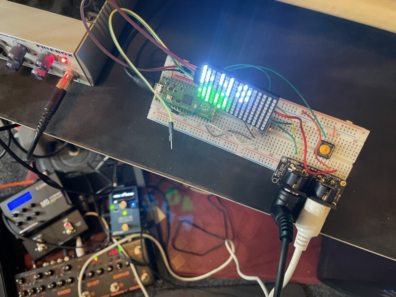

Initial breadboard prototype, working with the pedalboard in the bottom of shot.
Pleasantly surprised with the extent to which everything "just worked" up to this point.
The Raspberry Pi Pico and MicroPython make everything very easy.

---

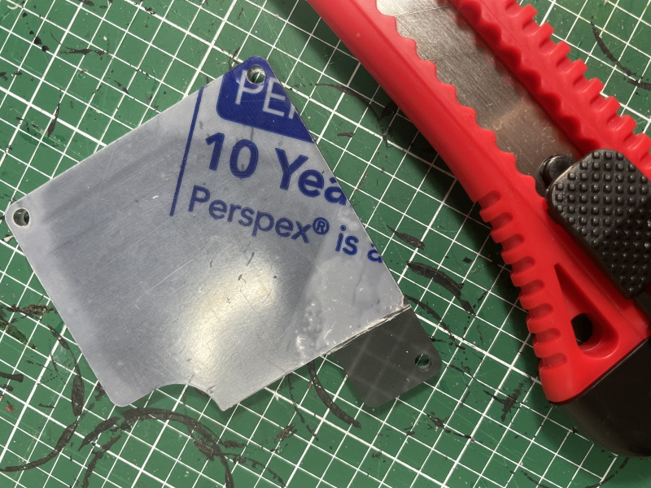

Starting on the external components. I wanted a cover for the display, to protect it and also bring
the brightness down a bit. It was annoyingly difficult to find some way to buy a very small piece of
Perspex, and I wasn't confident about doing a lot of cutting to size. I ended up finding this piece on
The Pi Hut designed for one of their custom modules. I just needed to cut off the bottom corner to get
the shape I wanted. I thoroughly scored it from both sides, snapped it off and then sanded smooth.

---

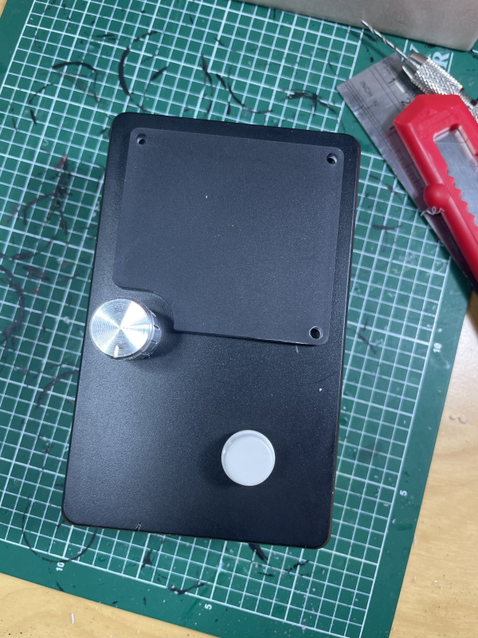

A quick rough sizing check of the external components
(the white button cap is a placeholder for the footswitch).

---

First hole cut in the enclosure; the window for the RGB LED matrix. I went with ABS rather than metal
because it's easier to work with using hand tools, lighter, and still sturdy enough. To cut the window
for the display, I started by drilling out the corners, then threaded through the detachable blade of
a coping saw to roughly cut out a hole that was definitely smaller than I needed. It was then easy to
shave the edges down to exactly the right size using a Stanley knife.

---

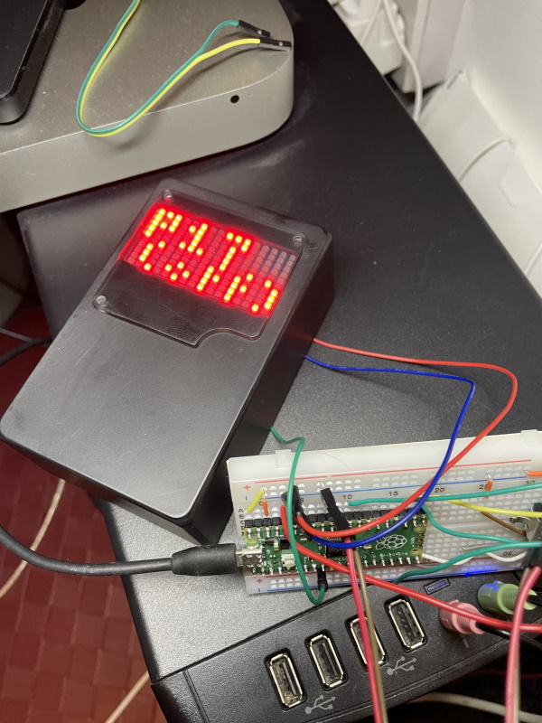

Checking operation of the RGB matrix inside the enclosure. The perspex was a bit more foggy than I wanted,
so I went at it with some very fine-grain sanding sponges until I got the desired clarity of the display.

---

I spent a long time considering different options for mounting everything. I originally planned to put the
boards on the base of the enclosure, but this would make the wiring quite a bit fiddlier (would need to
cope with me opening/closing the enclosure) so ended up building everything into the lid.

The RGB matrix came with pre-soldered headers on the back that couldn't easily be removed. I mounted the
Raspberry Pi Pico on the back of it, perpendicular to the intended orientation, to allow the USB port to
be exposed. This worked out quite nicely: the USB port, together with a couple of strips of plastic glued
inside the window, allowed the whole assembly to be snapped into place quite precisely.

---

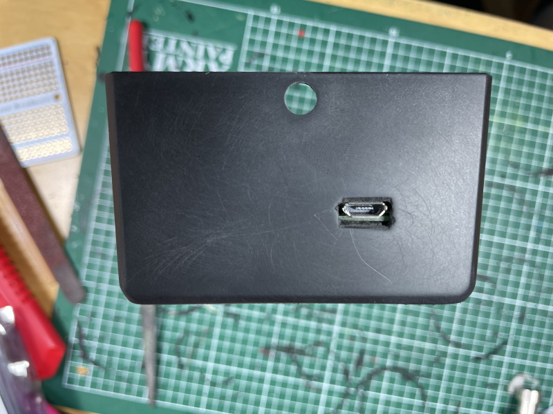

Rear view of the USB port. Initially drilled out, then filed to size. I ended up making this slightly
too big, so I covered up the slight gap you can see in this photo by cutting down a bit of waste plastic
to glue up against the USB port inside the enclosure (you can see this in a later photo).

---

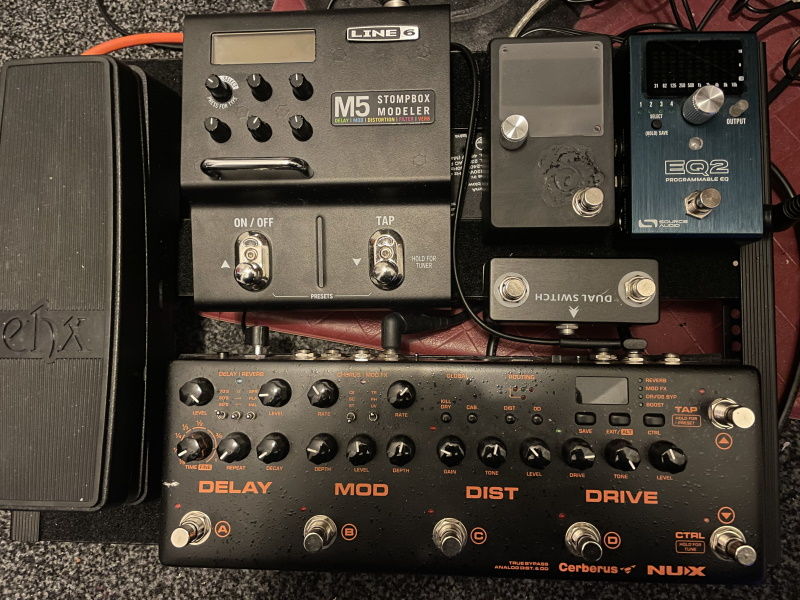

Check of the external appearance in place on the pedal board. The top of the enclosure looks a bit messy
at this point because, despite checking the layout beforehand, after fitting the footswitch I decided I
wanted to change the placement of it, so I had to patch up the hole I'd already drilled. Another advantage
of going with ABS rather than metal is that it's a bit more forgiving about this sort of thing.

---

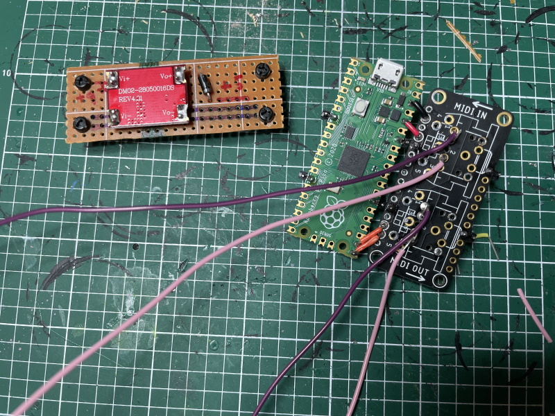

All the boards assembled. Buying a pre-built MIDI breakout board isn't strictly necessary (I think
it's just an optocoupler and a few resistors), but was convenient and fairly cheap. I initially
planned to use 5-pin DIN connectors, but abandoned this idea (partly due to having trouble finding
MIDI cables with suitably angled plugs to use on my board). Unsoldering those was a bit of a pain!

The MIDI breakout is designed for the AdaFruit Arduino-based controllers, but happens to have the
same profile as the Pico, so went rather neatly alongside it. These are plugged into the headers on
the back of the RGB LED matrix, although this is almost purely for the sake of alignment. None of
the pins are actually connected apart from one: the data pin for the display happens to line up
nicely with one of the Pico's GPIO pins, so I thought I might as well use it.

In this photo I've accidentally wired up the power pins for the MIDI breakout back-to-front. Had to
fix that later...

The other board here is just some stripboard with a 5V buck converter on it to let me power everything
from a standard 9V pedal power supply. The diode allows me to safely interchange this with a USB cable.
See the [the Pico datasheet](https://datasheets.raspberrypi.com/pico/pico-datasheet.pdf) for details
(section *4.5. Powering Pico*).

---

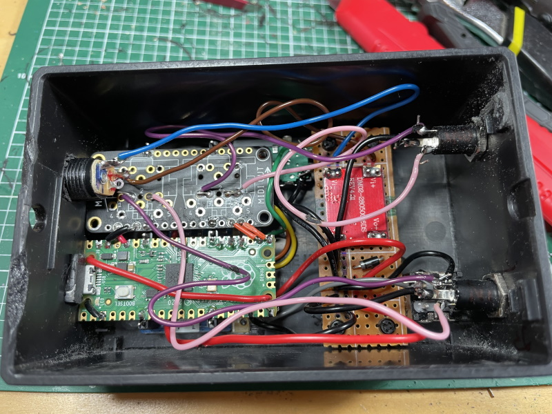

Everything fully assembled inside the pedal. Please excuse the messy soldering in places.

It was quite a tight fit, which was only partly due to careful measuring. I got a bit lucky with some
things, like the MIDI-in jack leaving *just* enough room for the footswitch.

The power jack is also right up against the MIDI breakout, which along with the Pico's USB port did
a pretty good job of keeping everything in place. However, before closing it up, I put some supporting
material (just some chopped up plastic jiffy bag) between these boards and the base of the enclosure,
so that I wasn't relying on these components for structural purposes.

---

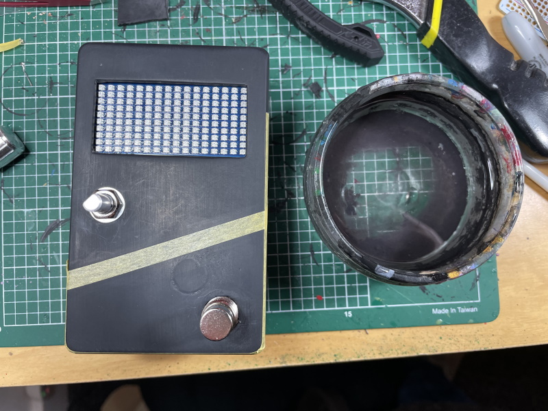

Everything from this point onwards is cosmetic. I decided it would look neat to have a second colour on
the enclosure, which would also help cover up the patch job on the original footswitch hole. Masking up
for painting here.

---

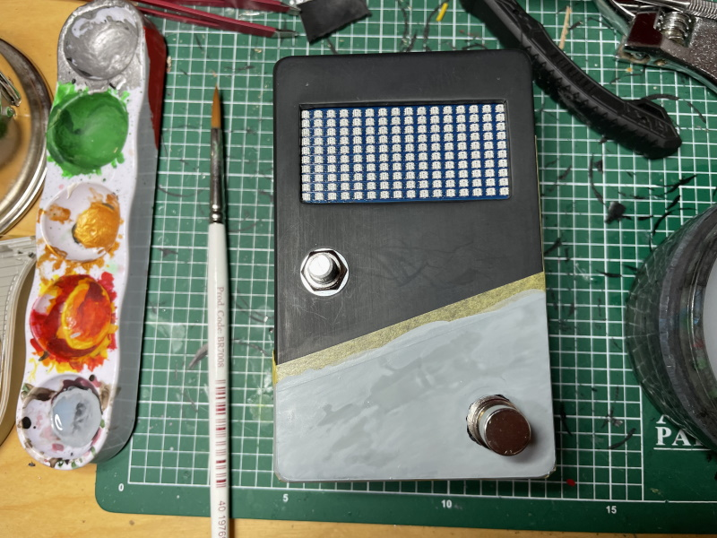

For some reason, I thought painting white on top of black would be fun. This took a *lot* of layers to
get a good finish...

---

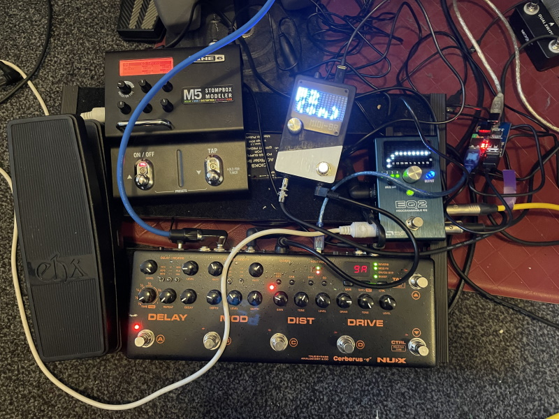

Finally done. Also found some white waterslide decals to add lettering (designed for model aeroplanes;
apparently this is the font used for RAF markings in WWII, but it looked modern enough for me).

Just waiting for some screws to arrive so I can attach the display cover...

---

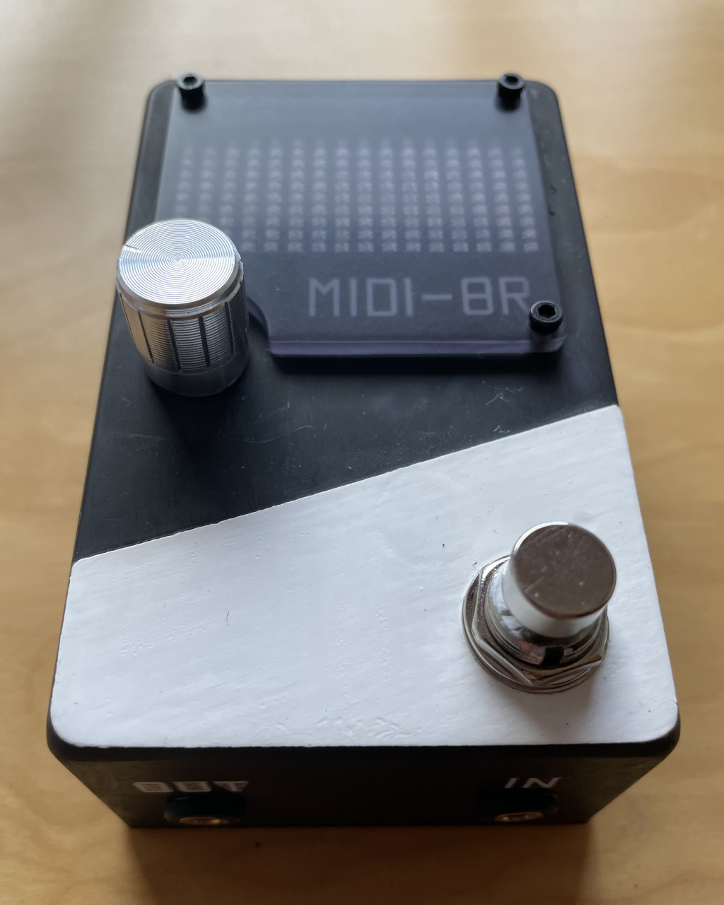

Full electrical/noise test with everything plugged together on the pedalboard, including:
* All the guitar signal connections
  (there are a lot of these because the signal passes through both the Cerberus and the EQ2 twice)
* All the MIDI connections
* All the USB-capable pedals connected to my desktop PC (via a USB isolator)

(I know the layout cable management is a mess here; I'm waiting for some more bits and pieces
to arrive so I can neaten it up).

I was pleased to find that nothing adds any extra noise into the guitar signal, apart from the PC
(which was already an issue with the existing pedals, and the USB isolator solves).

The new pedal produces a bit of RF noise (probably not surprising, given all the electronics and the
unshielded plastic enclosure) but this is only picked up if I put my guitar literally within a few
inches of it, and given that my pedalboard is on the floor, I'm unlikely to play in that position.
